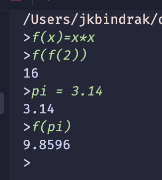

# math-interpreter



2. semester work for oop

## Basic usecase

Aritmetic 

```
>2+2
4
```

```
>2+2/3
2.66667
```

Introducing constants

```
>pi = 3.14
3.14
```
Constants can even use other constants

```
>tpi = 2*pi
4
```
functions

```
>f(x) = x *x
>f(f(2))
16
```

## TODO

- [ ] pattern matching
- [ ] grafy
